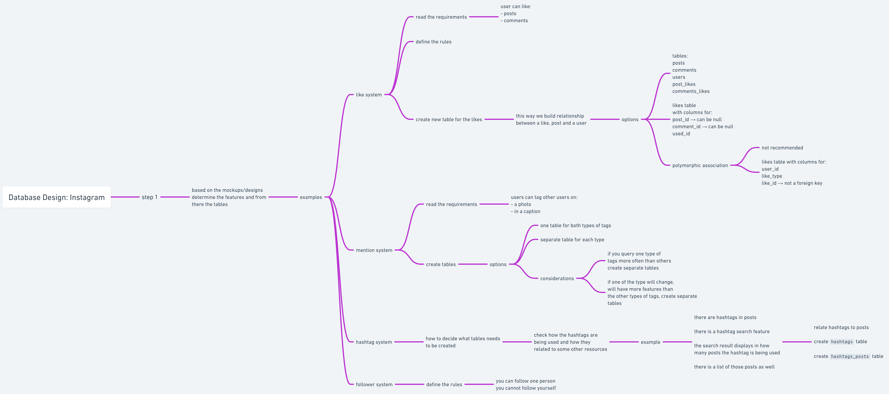

# Practice: Fullstack App

## Major Topics
- postgres
- NestJS
- react

### postgres

#### Notes

## Next steps
1. NestJS course
2. react course

## Learnig Resources
- [SQL and PostgreSQL: The Complete Developer's Guide](https://www.udemy.com/course/sql-and-postgresql/)  
- [NestJS: The Complete Developer's Guide](https://www.udemy.com/course/nestjs-the-complete-developers-guide/)  
- [Modern React with Redux](https://www.udemy.com/course/react-redux/)  

## Tools
- [dbdiagram](https://dbdiagram.io/)
- [whimsical](https://whimsical.com/)